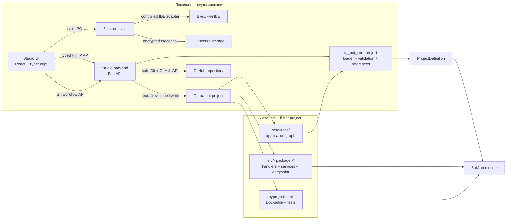
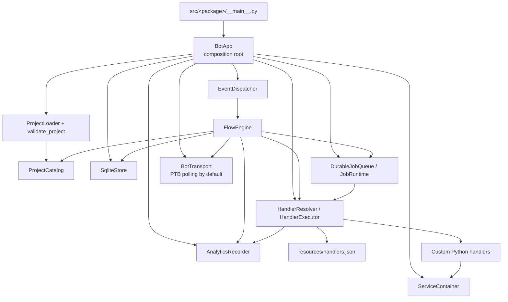
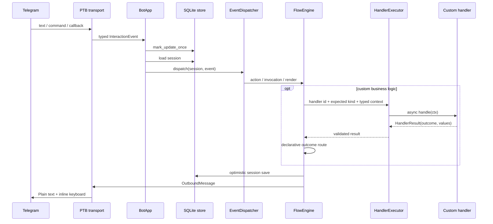

# Архитектура Telegram Bot Studio

## Коротко

Telegram Bot Studio — локальный control plane для файлов автономного Python-проекта. React UI редактирует типизированные сущности через FastAPI backend; backend сохраняет изменения непосредственно в папку бота и использует общий schema layer из `tg-bot-core`. После этого проект запускается самостоятельно: Studio, Electron и backend ему не нужны.

Стрелки от Studio заканчиваются на deployable files. Обратной runtime-зависимости от Studio нет.

## Источник истины

`resources/` полностью описывает визуальный application graph:

- manifest и `/start` policy;
- views, templates и keyboard actions;
- flows, states, state views, hooks и named events;
- commands и global fallbacks;
- explicit handler bindings и outcome routes;
- schedules.

Python-код проекта отвечает только за бизнес-операции и инфраструктурные services. Он не создаёт второй flow registry и не выбирает transitions напрямую.

## Runtime dependency map

| Компонент | Ответственность |
| --- | --- |
| `ProjectLoader` | Детерминированно читает схему проекта, не импортируя custom code |
| `validate_project` | Проверяет IDs, references, outcomes, callbacks, schedules, Jinja и при запросе AST handler files |
| `ProjectCatalog` | Индексирует button IDs/actions и рендерит views через Jinja |
| `EventDispatcher` | Выбирает ветку command/callback/message и global fallback |
| `FlowEngine` | Владеет lifecycle, actions, outcome routing, checkpoints и rendering |
| `HandlerResolver` | Разрешает только explicit module/symbol bindings и кеширует callables |
| `HandlerExecutor` | Разрешает binding, проверяет kind/result и добавляет structured log context; flow error boundary принадлежит dispatcher/engine |
| `SqliteStore` | Sessions, optimistic revisions, processed update deduplication и инициализация runtime tables |
| `AnalyticsRecorder` | Best-effort append-only запись структурированных runtime events в SQLite |
| `JobRuntime` | Materialization schedules, durable claim/lease/retry/history и task handlers |
| `BotTransport` | Граница входящих events и исходящих messages; production adapter использует PTB polling |
| `ServiceContainer` | Последовательное создание и обратное закрытие project services |

Контракт append-only событий, privacy rules и каталог имён описаны в
[analytics events](analytics-events.md).

## Поток интерактивного события

Если optimistic save конфликтует, `BotApp` один раз повторно загружает session и повторяет dispatch. Поэтому custom handlers должны учитывать возможность повторного вызова и самостоятельно обеспечивать idempotency внешних side effects.

## Startup и shutdown

На startup `BotApp`:

1. загружает project и запускает общую validation с inspection кода;
2. инициализирует SQLite;
3. создаёт services;
4. разрешает и импортирует все handler bindings;
5. индексирует actions и синхронизирует schedules;
6. запускает transport, scheduler и настроенное число worker coroutines.

На штатном shutdown runtime останавливает jobs, до 10 секунд ждёт background tasks, останавливает transport и закрывает services в обратном порядке. Ошибки закрытия логируются. Для process manager важно посылать сигнал, который даёт Python выполнить этот cleanup; практический systemd пример приведён в [deployment guide](../deployment/vps.md).

## Граница Studio

Backend читает и сохраняет manifest, views/templates, flows, commands, schedules и handlers; для file-per-entity resources есть create/delete операции. Он поддерживает revision conflicts, reference-safe deletion, validation, usages и handler inspection. Scaffolding может атомарно создать binding, безопасный Python path и привязку к выбранной сущности. Существующий source file не перезаписывается.

### Граница frontend Studio page

`frontend/src/pages/studio/StudioPage.tsx` остаётся composition/controller boundary и не владеет всеми деталями Studio:

- `StudioPageView.tsx` рендерит общий shell, `<Routes>`/`<Outlet>`, terminal, settings и status bar;
- `studio-routes.tsx` хранит единый typed registry route pages для router и левого rail;
- `pages/resources/ResourcesPage.tsx` владеет explorer, вкладками редакторов и preview;
- `pages/users/UsersPage.tsx` является route page для управления пользователями;
- `StudioEditor.tsx` выбирает typed editor для текущего ресурса;
- `editor-model.ts` содержит editor state и чистые преобразования selection/tab/draft;
- `studio-resource-api.ts` содержит typed CRUD branching для ресурсов;
- `useStudioLayout.ts`, `useLocalProjectRun.ts`, `useProjectSettings.ts`, `useStudioHandlers.ts` и `useStudioUndo.ts` изолируют независимые lifecycle.

Новые обязанности добавляются в соответствующий компонент, hook или чистый module, а не накапливаются в `StudioPage.tsx`. Для coding agents действует лимит 600 строк на `StudioPage.tsx`: достижение лимита является сигналом к декомпозиции до добавления новой логики.

Навигация основного левого rail реализована через `HashRouter`: routes доступны как `#/resources`, `#/users` и не требуют server fallback в Electron/Vite. Каждый основной пункт rail — отдельная page, которая монтируется через `<Outlet>`. Добавление страницы состоит из отдельного компонента в `frontend/src/pages/<route>/` и одной записи в `studio-routes.tsx`; локальный boolean/activity switch в Studio shell не используется.

Git collaboration — отдельная Studio integration, а не часть schema/runtime. Модули
`backend/app/integrations/git/` выполняют status/diff/history, безопасные
fast-forward Sync/Push/Publish, GitHub API и secret checks строго в `Workspace.root`.
Переносимые branch/repository settings находятся в `.botstudio/git.json`; credential
шифруется Electron `safeStorage` вне проекта. Generated bot не импортирует эту
integration и остаётся автономным. Подробный workflow описан в
[Git guide](../studio/git-workflow.md).

Electron открывает только существующий `.py` внутри canonical project root. Поддерживаются system association, VS Code, JetBrains и configurable executable; frontend не передаёт shell command.

### Local test run

Electron может запустить созданного бота для локальной проверки по кнопке Run. Запуск принадлежит только privileged Electron main process: renderer передаёт лишь путь к уже открытому в Studio project root и имя package. Перед первым запуском main process canonicalizes путь и добавляет его в approved roots только после проверки `resources/bot.json`; при запуске он повторно проверяет approved root и `src/<package>/__main__.py`.

После создания starter Electron автоматически выбирает совместимый Python 3.12/3.13, создаёт project-local `.venv` и устанавливает проект с dev-зависимостями. Хеш `pyproject.toml` хранится в служебном marker внутри `.venv`: при изменении зависимостей окружение обновляется перед следующим Run. Отсутствующее или несовместимое окружение восстанавливается автоматически. Для ранее сгенерированных starter устаревшие pins `core-v3.0.0` и `b183a173a3f46f2b096a0b6ec877ad5cba41566a` атомарно заменяются опубликованным immutable commit; остальные dependency declarations сохраняются. Сам запуск всегда выполняет фиксированную команду `.venv/python -m <package>` без shell; процесс принудительно завершается вместе со Studio.

Это локальная оркестрация для тестов, а не embedded runtime: запущенный бот по-прежнему импортирует только свои `resources/`, `src/` и зависимости. Он не получает зависимости от Studio, Electron или backend.

Electron main владеет stdin/stdout/stderr локального процесса и передаёт renderer только типизированные output events. Нижняя terminal panel показывает lifecycle Studio и сырой stdout/stderr бота; закрытие панели не останавливает процесс. Stop отправляется отдельным IPC-вызовом только найденному процессу текущего approved project root.

## Фактические ограничения

- Только Telegram text messages, commands и callbacks; media/location/member events не моделируются.
- PTB adapter использует polling; webhook adapter отсутствует.
- Только `interval` schedules; `cron` и `once` ещё не реализованы.
- Нет embedded Python editor, sandbox или hot reload custom code.
- Update deduplication фиксируется до завершения dispatch; упавший update автоматически не возвращается в обработку.
- Save session и enqueue job выполняются двумя SQLite transactions.
- Queue использует leases без process owner/fencing token; production deployment рекомендуется держать в одном process на database.
