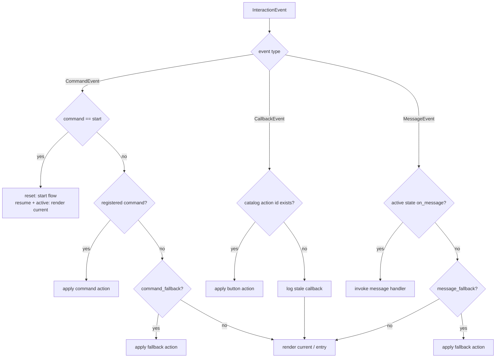
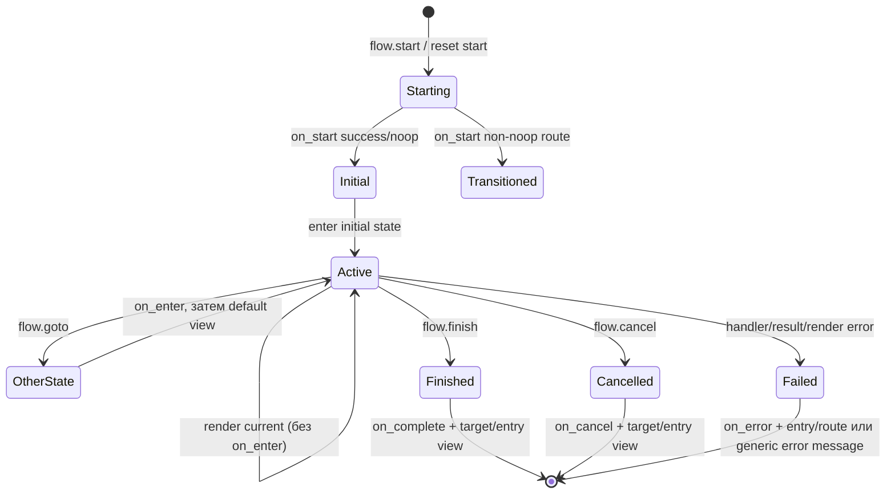
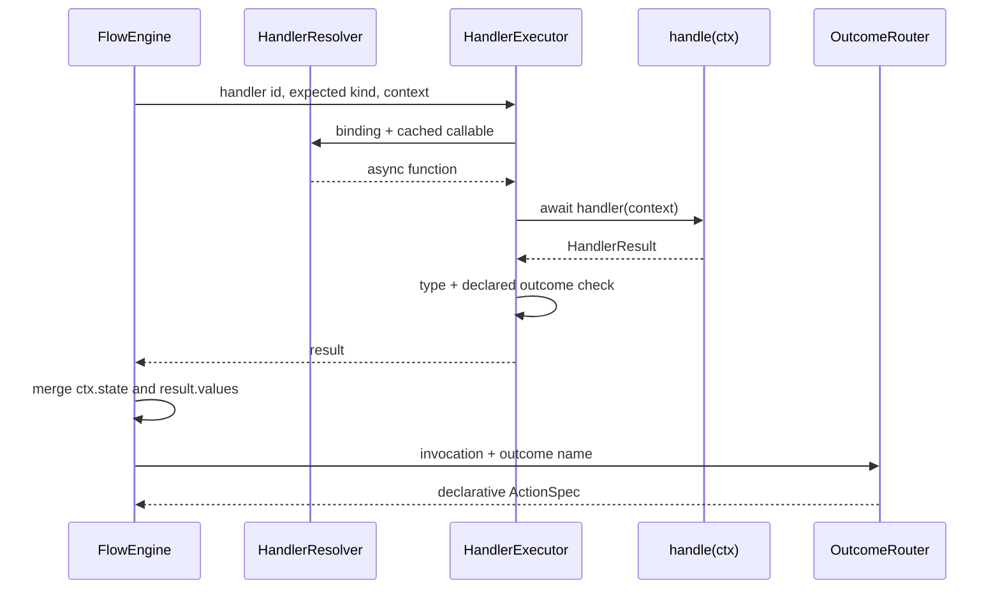
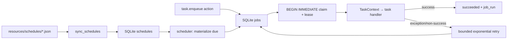

# Runtime dispatch и lifecycle

Документ описывает текущую цепочку `PtbTransport → BotApp → EventDispatcher → FlowEngine` и отдельный `JobRuntime`.

## Startup

`BotApp.start()` выполняет действия в таком порядке:

1. `ProjectLoader` читает schema v3.
2. `validate_project(..., inspect_code=True)` проверяет graph и handler source signatures. Любая error diagnostic останавливает startup до polling.
3. `SqliteStore` инициализирует runtime tables (`CREATE TABLE IF NOT EXISTS`) и включает WAL.
4. `ServiceContainer` создаёт providers последовательно.
5. `HandlerResolver.validate_all()` импортирует каждый explicit binding и кеширует async callable.
6. `ProjectCatalog` индексирует button ID → action.
7. Resource schedules синхронизируются с SQLite.
8. Выбирается переданный `BotTransport` либо создаётся PTB adapter с `BOT_TOKEN`.
9. Запускаются transport, одна scheduler coroutine и `worker_count` job workers.

Startup не импортирует Studio packages и не читает никакую Studio database.

## Transport events

PTB polling adapter принимает три вида update:

| Telegram input | Core event | Полезные поля |
| --- | --- | --- |
| `/name arguments` | `CommandEvent` | normalized command без `/`/bot suffix, оставшаяся строка `arguments` |
| обычный text | `MessageEvent` | `text` |
| inline callback `v3:a:<id>` | `CallbackEvent` | decoded `action_id` |

Во всех событиях есть `Actor(user_id, chat_id, username, first_name, last_name)` и Telegram `update_id`. Updates без effective user/chat не поддерживаются.

Callback query сначала получает `answer()`. Payload с неверным prefix/пустым ID transport безопасно игнорирует и пишет warning. Dispatcher разрешает action только если button ID существует на текущем сохранённом view; отсутствующий либо принадлежащий другому view callback считается stale/inactive, логируется и приводит только к re-render current view.

## Deduplication и optimistic session

До обработки `BotApp.handle_event()` вставляет `(bot_id, user_id, chat_id, update_id)` в `processed_updates`. Повторная вставка прекращает dispatch. Затем загружается session с ключом `(bot_id, user_id, chat_id)`.

Session содержит:

```text
flow_id | state_id | view_id | variables | status | revision
```

Statuses: `idle`, `active`, `finished`, `cancelled`, `failed`. Save использует optimistic `revision`. При `SessionConflict` приложение повторно загружает session и один раз повторяет весь dispatch; второй conflict выходит ошибкой.

Следствия текущей реализации:

- внешний side effect custom handler может повториться при conflict — handler/service должны обеспечивать idempotency;
- update помечен processed до dispatch, поэтому exception после отметки не приводит к автоматической повторной обработке того же update;
- session обычно сохраняется перед outbound send, поэтому ошибка Telegram send может оставить уже продвинутую session.

## Dispatch order

Command, callback и message — взаимоисключающие event types. Поэтому общий порядок нужно читать как три отдельные ветки, а не как попытку проверить callback после неизвестной команды.



Unknown commands не превращаются в ordinary messages. Active state `on_message` имеет приоритет над global message fallback. Если ничего не подходит, runtime показывает explicit `session.view_id`, иначе default view активного state, иначе manifest entry view.

## `/start`

- `start.policy = reset`: flow всегда создаётся заново, variables сбрасываются в `{}`.
- `start.policy = resume`: если session `active`, runtime только показывает current view и не вызывает `on_start`/`on_enter`; иначе запускает start flow заново.

Registered command `/start` запрещён validator, поэтому встроенная semantics однозначна.

## Actions

`FlowEngine` исполняет `noop`, `view.render`, `flow.start`, `flow.cancel`, `flow.event`, `flow.goto`, `flow.finish`, `handler.invoke` и `task.enqueue`. Поля перечислены в [project schema](project-schema-v3.md#actions).

Каждый вызов action/start/enter увеличивает счётчик automatic chain. При превышении `max_auto_transitions` возникает `HandlerExecutionError`; default limit — 32. Это runtime guard, а не статическое доказательство отсутствия циклов.

`view.render` не меняет state и не вызывает `on_enter`. `flow.event` ищет named invocation только в текущем active state; без active flow либо без такого event runtime сохраняет/re-renders current view (для неизвестного event также пишет warning).

`task.enqueue` сначала сохраняет session, затем отдельной transaction добавляет job и показывает выбранный/current view. Это не атомарная операция: crash между save и enqueue может потерять task.

## Flow lifecycle



Точные правила:

- Flow start выставляет `active`, initial state ID и пустые variables, затем вызывает `on_start`.
- Non-`noop` outcome route `on_start` применяется немедленно и может не допустить обычный вход в initial state.
- Реальный вход в state вызывает `on_enter`; после `success/noop` показывается state default view. Non-`noop` route может перенаправить раньше rendering.
- `flow.finish` вызывает `on_complete`, `flow.cancel` — `on_cancel`; затем active `flow_id/state_id` очищаются.
- Completion/cancel hook может вернуть declarative route. Без неё показывается action `view` либо entry view.
- Ошибка custom handler/unknown result/automatic limit обрабатывается как `HandlerExecutionError`; ошибка Jinja rendering — как `CatalogError`. В обоих случаях при active flow вызывается `on_error` с `payload.error`, затем status становится `failed` и flow/state очищаются. Перед recovery runtime перечитывает session, поскольку render мог упасть уже после успешного checkpoint.
- Если `on_error` отсутствует или сам падает, session сохраняется как failed и transport отправляет `The bot could not complete that action.`

Не все инфраструктурные exceptions превращаются в `on_error`: dispatcher перехватывает `HandlerExecutionError` и `CatalogError`. Ошибки loader, store или transport могут подняться выше и логироваться/обрабатываться владельцем процесса.

## Handler execution и outcome routing



Context type выбирается trigger kind. Interactive context не содержит `BotApp`, store или transport. State начинается как копия session variables. Изменения через `ctx.state` объединяются с `HandlerResult.values`; result values имеют приоритет. После JSON-serializability check полученная session передаётся следующей action/checkpoint.

`HandlerExecutor` требует экземпляр `HandlerResult`, разрешает только `success` и binding `outcomes`, а exception custom-кода оборачивает в `HandlerExecutionError`. Startup validation требует explicit route для `success` и каждого declared outcome во всех invocations. Named outcome без route на runtime является ошибкой.

## Rendering и callbacks

Catalog рендерит inline/template Jinja с `StrictUndefined`. Variables включают session state и `user` mapping. Keyboard buttons получают callback data через `CallbackCodec`; protocol содержит только stable global button ID. Старое сообщение может всё ещё прислать callback: button с другого view считается inactive; удалённый ID — stale. Если тот же ID переиспользован на том же view с другим смыслом, будет выполнена его текущая action, поэтому IDs следует сохранять стабильными.

## Durable tasks и schedules

SQLite хранит `jobs`, `schedules` и `job_runs` рядом с sessions.



- Реализован только positive `interval` trigger.
- Новый schedule получает `next_run_at = now`, то есть первая job появляется при ближайшем scheduler tick, а не после первого полного interval.
- Если process был выключен несколько intervals, materializer создаёт одну job и переносит next run вперёд, пропуская массовый catch-up.
- Claim выполняется в `BEGIN IMMEDIATE`; processing job имеет lease, который worker регулярно renews.
- Default max attempts — 5; retry delay растёт экспоненциально от 5 секунд и ограничен 900 секундами.
- Task handler получает `TaskContext(job_id, payload, services, logger)`, обязан вернуть success и не имеет outcome routing/session state. Его `HandlerResult.values` не используются.

Lease record сейчас не имеет owner/fencing token. Для одной database рекомендуется один runtime process; concurrency обеспечивают worker coroutines внутри него.

## Shutdown

`BotApp.stop()` ставит stop flags, прекращает новые scheduler/worker iterations, до 10 секунд ждёт tasks и отменяет оставшиеся, затем останавливает transport и закрывает services в обратном порядке. Cleanup errors логируются и не мешают попытке закрыть остальные компоненты.
